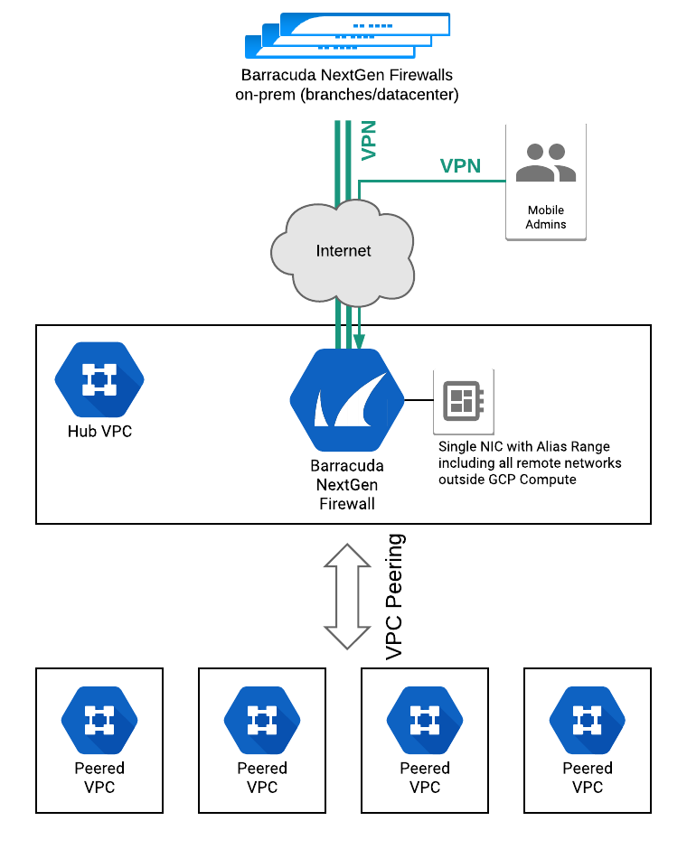

# Barracuda NextGen Firewall - Multi-VPC Connectivity

This solution deploys a new VPC (Hub VPC) and an NGF instance forming an access hub between peered VPCs and external resources.



More information on the architecture can be foundin [Barracuda Campus]().
## Before You Begin
Know:
* subnet CIDR you want to assign to Hub VPC
* subnet CIDR you want to route through the firewall (it should cover all your on-prem ranges, currently only a single IP subnet is allowed by this solution)

Prepare:
* prepare your Google SDK/gcloud environment (either on your workstation or using Google Cloud Shell) and enable deployment-manager API

## How to deploy

1. copy the `sample-deploy.yaml` *configuration* file to your computer
1. modify it to match your configuration
1. deploy using gcloud:
```
gcloud deployment-manager deployments create my-deployment --config sample-deploy.yaml
```
